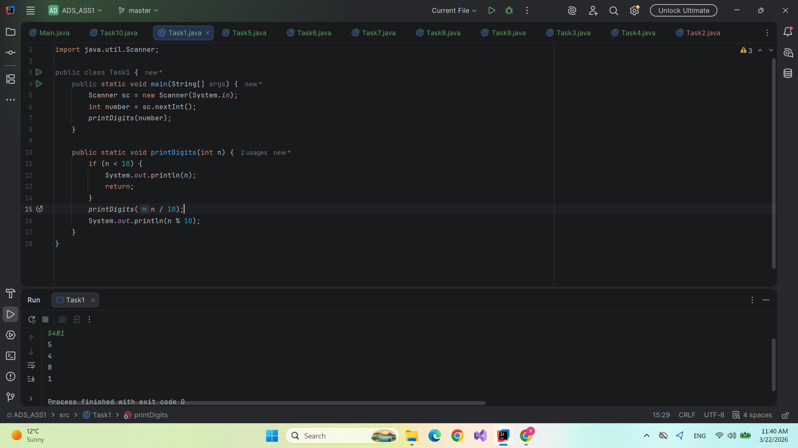
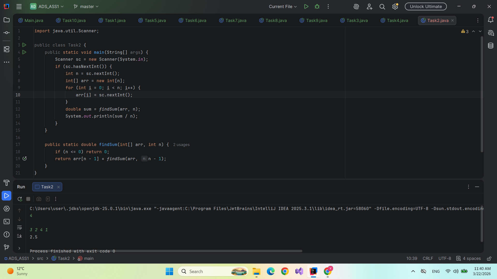
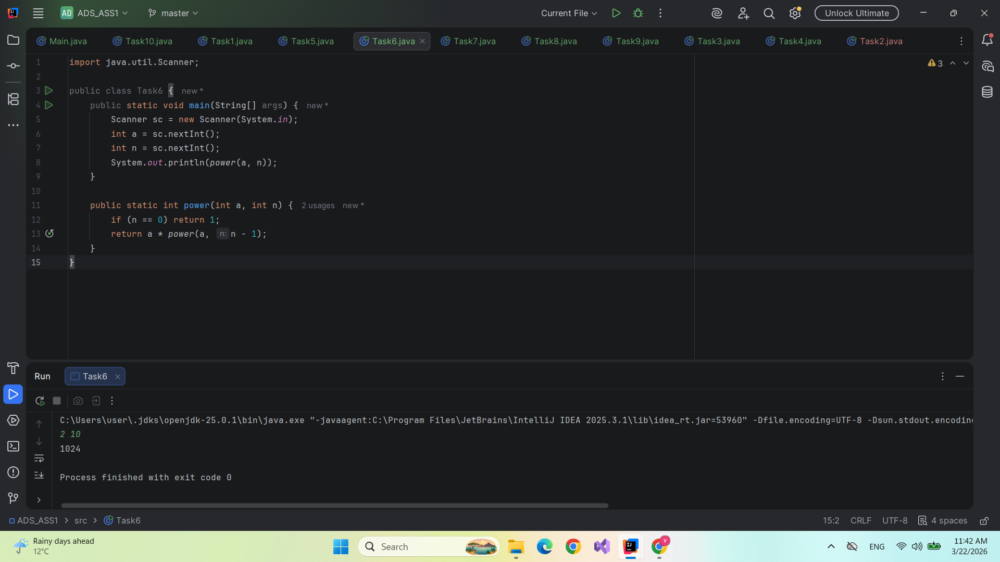
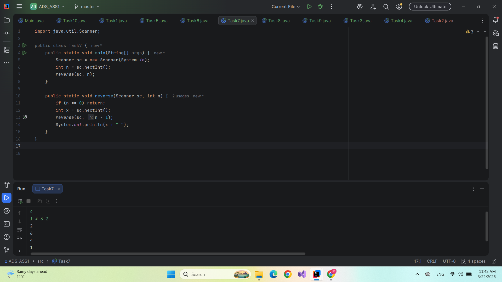
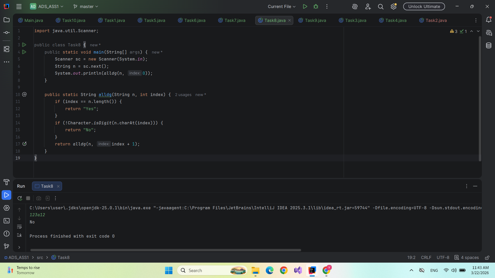
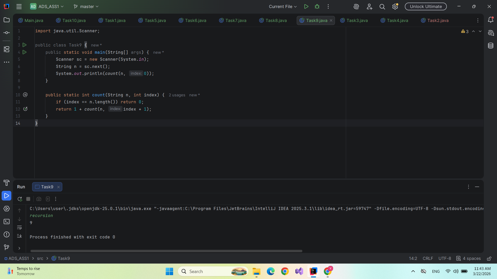
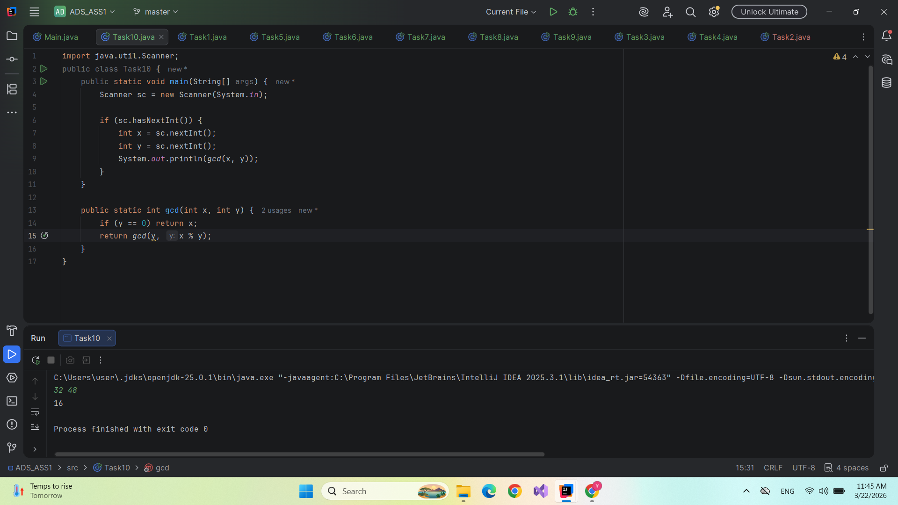

# ADS: Assignment 1 - Recursion

**Student:** Bazarbay Uldanay
**Group:** SE-2512

This project contains 10 solutions for **Assignment 1** focusing on **Recursion** in Java. 
The main objective is to implement fundamental algorithms without using any loops (`for`, `while`).

## Problem Set

1.  **Task 1**: Output the digits of a number in order.
2.  **Task 2**: Find the arithmetic mean (average) of an array.
3.  **Task 4**: Calculate the factorial of a number ($n!$).
4.  **Task 5**: Find the $n$-th Fibonacci number.
5.  **Task 6**: Calculate the power of a number ($a^n$).
6.  **Task 7**: Reverse a sequence of numbers (using recursion stack).
7.  **Task 8**: Check if a string consists only of digits.
8.  **Task 9**: Count the number of characters in a string.
9.  **Task 10**: Find the Greatest Common Divisor (GCD) using the Euclidean Algorithm.
10. **Task 3**: Determine if a number is Prime.

## Implementation Details
- **Language**: Java
- **Constraint**: No iterative loops allowed. All solutions must use recursive calls.
- **Input**: Handled via `java.util.Scanner`.

- ## Screenshots
Below are the execution results for each task as seen in the console:

### Task 1: Print Digits

### Task 2: Find Sum

### Task 3: Is Prime Number

### Task 4: Factorial

### Task 5: Fibonacci

### Task 6: Power

### Task 7: Reverse 

### Task 8: Is All Digit

### Task 9: Count Lenghth

### Task 10: GCD 

